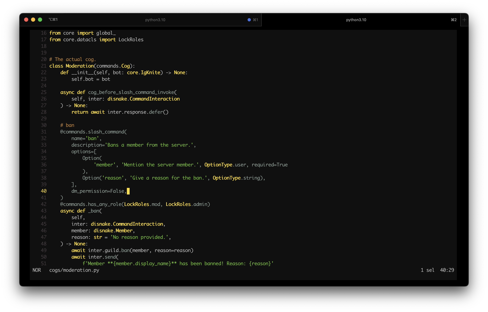

# Gruber Darker for Helix

Gruber Darker color theme for [Helix Editor](https://helix-editor.com/). For more info, check out rexim's [gruber-darker-theme](https://github.com/rexim/gruber-darker-theme).

# Preview

<p align="center"><br>Project in preview: <a href="https://github.com/IgKniteDev/IgKnite">IgKnite</a></p>

# Install

- Get Helix. 
- Clone the repo.
- Grab the `themes/gruber-darker.toml` file.
- Place it into your `/themes` folder. (i.e. `~/.config/helix/themes` on Linux/MacOS and `%AppData%\helix\themes` on Windows)
- Place this inside your `config.toml` file.
```toml
theme = "gruber-darker"
```
- Save and you're good to go.